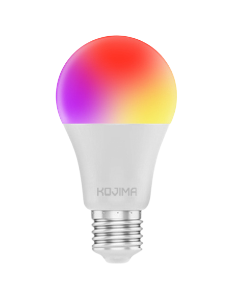

# Mika — голосовой ассистент управления умными устройствами

> Дипломная работа (ВКР), специальность **09.02.07 «Информационные системы и программирование»**,
> ГБПОУ СКС им. В.А. Петрова, 2025 г.

Программная система управления умным домом с **офлайн-распознаванием речи**. Работает на
обычном компьютере (не требует «умной колонки»), распознаёт голосовые команды без интернета
и управляет умными устройствами через API. Интерфейс — настольное приложение на PyQt6.

## Возможности
- Активация по фразе **«Мика»** и приём голосовых команд (офлайн, библиотека Vosk).
- Управление освещением: вкл/выкл, выбор цвета (10 цветов), яркость, тёплый/холодный свет,
  режим «дыхания» (плавное изменение яркости).
- Музыкальный режим: реакция на громкость музыки в комнате.
- Управление компьютером: выключение, открытие папок, браузера, регулировка громкости.
- Погода, текущее время.
- Голосовое подтверждение опасных действий и воспроизведение голосовых ответов (аудио «озвучка»).
- Анимированный интерфейс ассистента и список управляемых устройств.

## Технологии
| Слой | Технология |
|---|---|
| Язык | Python 3 |
| GUI | PyQt6 (сигналы/слоты, QThread) |
| Распознавание речи | Vosk (модель `vosk-model-small-ru-0.22`) + PyAudio |
| Управление устройствами | Yandex IoT API (REST, `requests`) |
| Звук/аудиоответы | pygame |
| Прочее | NumPy |

## Архитектура
Модульная, объектно-ориентированная. Логика разбита на независимые компоненты:

```
Mika_main.py          # VoiceAssistant, AudioProcessor(QThread) — распознавание и логика
command_handler.py    # CommandHandler — маршрутизация команд
Mika_UI.py            # AssistantUI, FaceWidget, DeviceTile — интерфейс
commands/             # команды (паттерн Command)
  ├─ command.py               # базовый класс Command
  ├─ light_control.py         # свет, цвета, яркость, режим «дыхания»
  ├─ music_mode.py            # музыкальный режим
  ├─ computer_control.py      # выключение ПК
  ├─ volume.py                # громкость
  ├─ browser_command.py       # браузер
  ├─ weather_command.py       # погода
  ├─ time_command.py          # время
  ├─ system_folders.py        # системные папки
  └─ control_kojima_bulb.py   # низкоуровневый клиент устройства
audio_responses/      # звуковые ответы ассистента
images/, fotos/       # графика и иконки
docs/                 # документация проекта (диплом, речь, презентация, руководство)
```

## Запуск
1. Установить Python 3.10+ и зависимости:
   ```bash
   pip install -r requirements.txt
   ```
2. Скачать модель Vosk `vosk-model-small-ru-0.22` и положить её в корень проекта:
   ссылка — https://alphacephei.com/vosk/models (не хранится в репозитории из-за размера ~87 МБ).
3. Скопировать `settings.example.json` → `settings.json` и `commands/token_store.example.json`
   → `commands/token_store.json`, заполнить свои mic/speaker index и токены Yandex IoT.
4. Запустить:
   ```bash
   python Mika_main.py
   ```

## Интерфейс





## Документация
Папка `docs/` содержит материалы ВКР: `Диплом…docx`, `Речь_дипломная…docx`,
презентацию, отчёт по преддипломной практике и руководство пользователя.

## Автор
**Бугаев Евгений Валерьевич**, группа ИП-212. Год: 2025.
